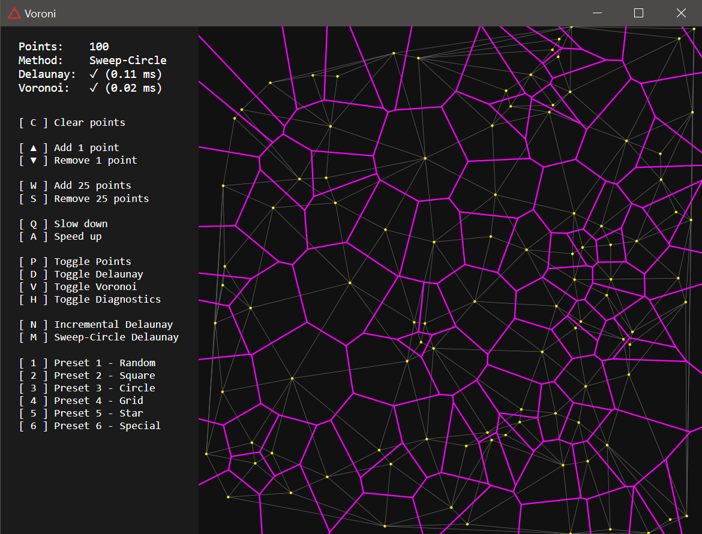

# Delaunay and Voronoi triangulation algorithms and visualization

Implementation of naive and Sweep-Circle Delaunay triangulation, combined with Voronoi. Sweep-Circle based on: [http://cglab.ca/~biniaz/papers/Sweep%20Circle.pdf]

## Screenshots

